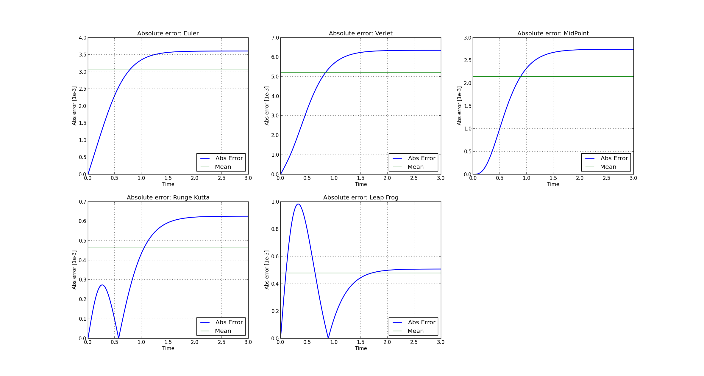
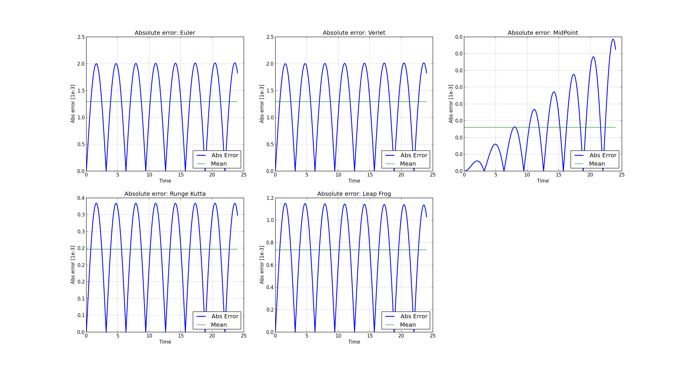
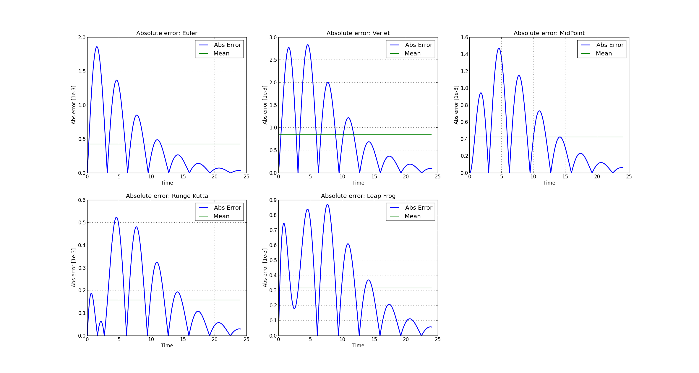
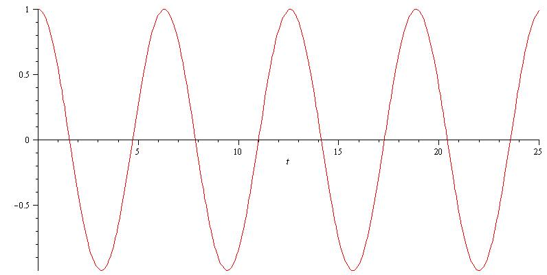

Testing Procedures
==================

The procedure used in the tests is based on a comparison between a numerical solution and an analytical solution.

Considering that the three bodies problem does not have a known analytical solution, the problems used in the tests generally will be based on systems of two particles, except in special cases.

Tests currently implemented:

    #. Free fall in a drag fluid.
    #. Harmonic motion
    #. Damped harmonic motion
    
For executiong the tests via pyparticles_add we must use the option -d ::

    pyparticles_add -d <test_name>
  
Commands for executing available tests: ::

    pyparticles_app -t fall
    pyparticles_app -t harmonic
    pyparticles_app -t dharmonic
    

Test problems definitions
-------------------------

Free fall in a drag fluid
+++++++++++++++++++++++++

The free fall test is based on a single particle that falls in a constant force field with a drag fluid (or air).

The equation of motion is defined as follow:

.. math::

    m{\frac {d^{2}}{d{t}^{2}}}X \left( t \right) =mg+1/2\,k \left( {\frac {d}{dt}}X \left( t \right)  \right) ^{2}

Where:

 | :math:`m=1`
 | :math:`g = -10`
 | :math:`k = 1`

And as initial condition I've used:

 | :math:`X(0) = 0`
 | :math:`\dot{X}(0) = 0`

The analytical solution is given by the following expression:

.. math::

    x(t) = 2\,\sqrt {5}t-2\,\ln  \left( 1/2\,{{\rm e}^{2\,\sqrt {5}t}}+1/2 \right) 

In pyparticles the problem is desribed as follow: ::

    constf = cf.ConstForce( self.pset.size , u_force=[ 0 , 0 , -10.0 ] , dim=self.pset.dim )
    drag = dr.Drag( self.pset.size , Consts=1.0 )
    
    multi = mf.MultipleForce( self.pset.size )
    
    multi.append_force( constf )
    multi.append_force( drag )
    
    multi.set_masses( self.pset.M )

Harmonic motion
+++++++++++++++

The first particle is fixed to a point while the second free to move.

The equation of motion is defined as follow:

.. math::

    m{\frac {d^{2}}{d{t}^{2}}}X \left( t \right) =-kX \left( t \right)
    
    
Where:

 | :math:`m = 1`
 | :math:`k = 1`

And as initial condition I've used:

 | :math:`\mathbf{X}(0) = \begin{bmatrix} \frac{1}{\sqrt{3}} \\ \frac{1}{\sqrt{3}} \\ \frac{1}{\sqrt{3}} \end{bmatrix}`
 | :math:`\dot{\mathbf{X}}(0) = \begin{bmatrix} 0 \\ 0 \\ 0 \end{bmatrix}`

The analytical solution is given by the following expression:

.. math::

    \mathbf{X}\left ( t \right ) = \begin{bmatrix}\frac{\cos{t}}{\sqrt{3}}\\ \frac{\cos{t}}{\sqrt{3}}\\ \frac{\cos{t}}{\sqrt{3}}\end{bmatrix}

In pyparticles the problem is desribed as follow: ::

    self.pset.X[0,:] = 0.0
    self.pset.X[1,:] = 1.0 / np.sqrt(3)
    
    ci = np.array( [ 0 ] )
    cx = np.array( [ 0.0 , 0.0 , 0.0 ] )
    
    costrs = csx.ConstrainedX( self.pset )
    costrs.add_x_constraint( ci , cx )
    
    self.t = np.zeros(( self.steps ))
    self.x = np.zeros(( self.steps , self.pset.dim ))
    
    self.xn = np.zeros(( self.steps , self.pset.dim ))
            
    spring = ls.LinearSpring( self.pset.size , self.pset.dim , Consts=1.0 )

Damped Harmonic motion
++++++++++++++++++++++

The first particle is fixed to a point while the second free to move. The damping force has a magnitude proportional to the velocity.

The equation of motion is defined as follow:

.. math::

    m{\frac {d^{2}}{d{t}^{2}}}X \left( t \right) =-c{\frac {d}{dt}}X \left( t \right) -k X \left( t \right) 
 
Where:

 | :math:`m = 1`
 | :math:`c = 1/2`
 | :math:`k = 1`

And as initial condition I've used:

 | :math:`\mathbf{X}(0) = \begin{bmatrix} \frac{1}{\sqrt{3}} \\ \frac{1}{\sqrt{3}} \\ \frac{1}{\sqrt{3}} \end{bmatrix}`
 | :math:`\dot{\mathbf{X}}(0) = \begin{bmatrix} 0 \\ 0 \\ 0 \end{bmatrix}`
 

The analytical solution is given by the following expressions:

The magnitude of :math:`X(t)` is:

.. math::

    X \left( t \right) =1/15\,\sqrt {15}{{\rm e}^{-1/4\,t}}\sin \left( 1/4\,\sqrt {15}t \right) +{{\rm e}^{-1/4\,t}}\cos \left( 1/4\,\sqrt {15}t\right)

The vectorized and effective solution of the initial value problem, is:

.. math::

    \mathbf{X}\left ( t \right ) = \begin{bmatrix} \frac{X(t)}{\sqrt{3}} \\ \frac{X(t)}{\sqrt{3}} \\  \frac{X(t)}{\sqrt{3}}\end{bmatrix}
    
    
In pyparticles the problem is desribed as follow: ::

    self.pset.X[0,:] = 0.0
    self.pset.X[1,:] = 1.0 / np.sqrt(3)
    
    ci = np.array( [ 0 ] )
    cx = np.array( [ 0.0 , 0.0 , 0.0 ] )
    
    costrs = csx.ConstrainedX( self.pset )
    costrs.add_x_constraint( ci , cx )
            
    spring = ls.LinearSpring( self.pset.size , self.pset.dim , Consts=1.0 )
    damp = da.Damping( self.pset.size , self.pset.dim , Consts=0.5 )
    
    multi = mf.MultipleForce( self.pset.size )
    
    multi.append_force( spring )
    multi.append_force( damp )
    
    multi.set_masses( self.pset.M )
    
    
Tests results
-------------

Below are shown evolution of the absolute error in the problems described above, we can see that the error is always low and reasonably acceptable.

(To see the image at full size, it must be opened in another tab)

Free fall in a drag fluid
+++++++++++++++++++++++++

   
   
Harmonic motion
+++++++++++++++
   

   
Damped Harmonic motion
++++++++++++++++++++++
   

   

Analytical solutions plot
-------------------------

Free fall in a drag fluid
+++++++++++++++++++++++++

.. image:: img/fall_an.jpg
   :width: 50%
   
Harmonic motion
+++++++++++++++

   
Damped Harmonic motion
++++++++++++++++++++++

.. image:: img/dam_an.jpg
   :width: 50%